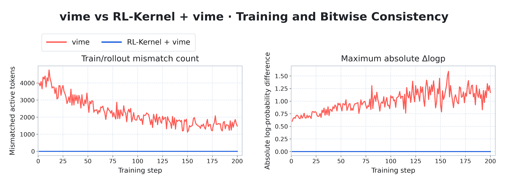
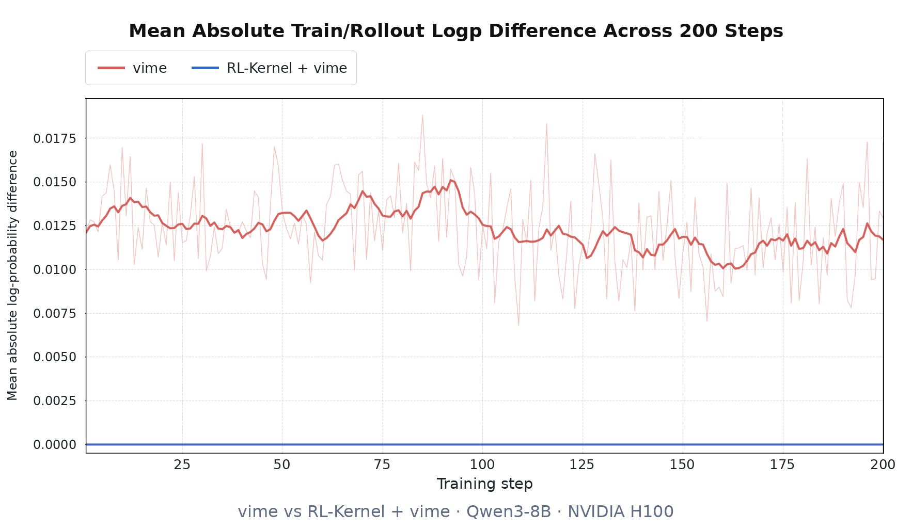
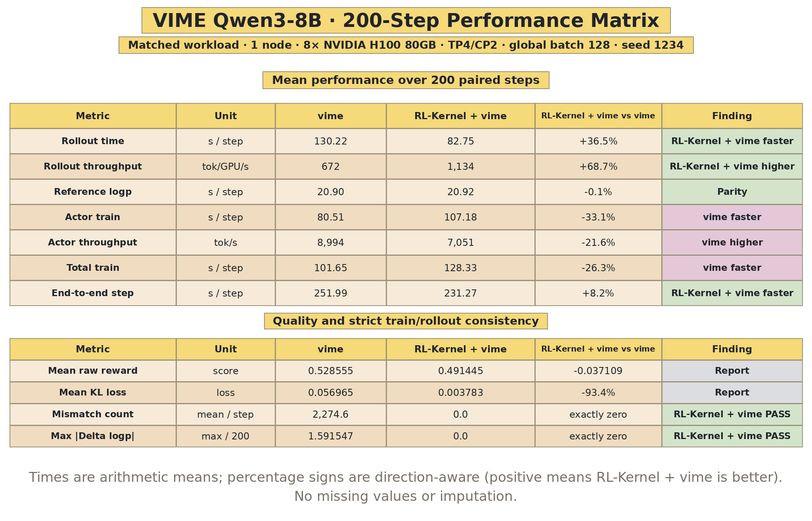
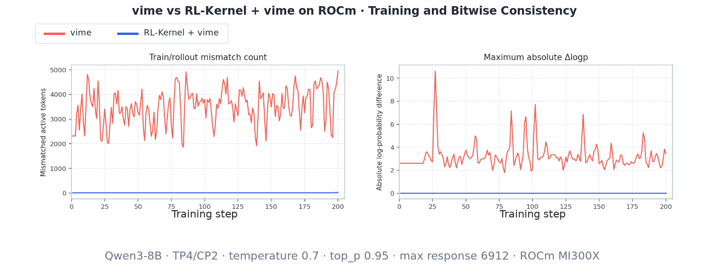
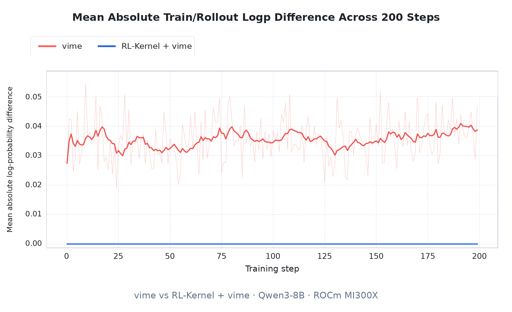
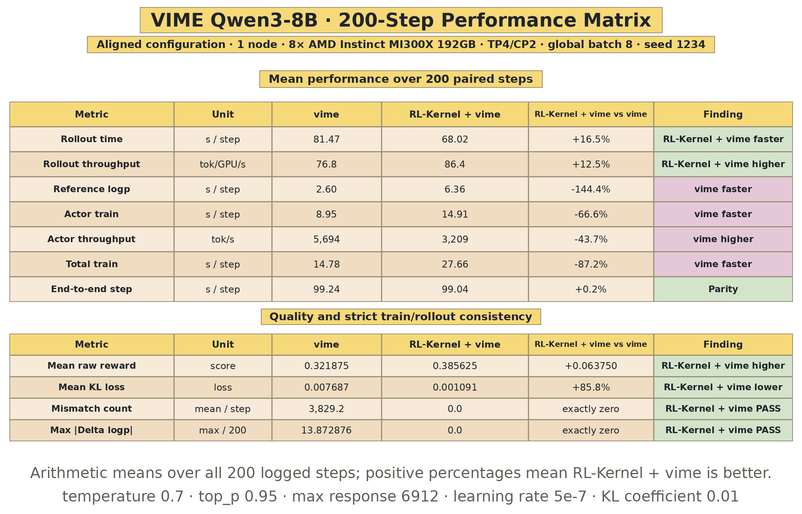

<p align="center">
  
</p>

<h1 align="center">RL-Kernel</h1>

<p align="center">
  <strong>Building cross-hardware and multi-model RL post-training infrastructure for kernel-level train–inference consistency.</strong>
</p>

<p align="center">
  <a href="https://rl-align.github.io/RL-Kernel/"></a>
  <a href="https://rlalign.ai"></a>
  <a href="https://rl-align.slack.com/join/shared_invite/zt-46bxj7uyt-gEK3xzwSJr_lppJsZolR~g#/shared-invite/email"></a>
  <a href="https://www.linkedin.com/company/rl-align"></a>
  <a href="https://x.com/RLKernel"></a>
  <a href="./docs/community/wechat.md"></a>
  <a href="./docs/assets/whatsapp-group.png"></a>
  <a href="https://deepwiki.com/RL-Align/RL-Kernel"></a>
  <a href="#hardware-support"></a>
  <a href="https://opensource.org/licenses/Apache-2.0"></a>
</p>

<p align="center">
  <a href="#architecture">Architecture</a> ·
  <a href="#current-scope-and-roadmap">Current scope</a> ·
  <a href="#benchmark-highlights">Results</a> ·
  <a href="#hardware-support">Hardware support</a> ·
  <a href="#quick-start">Quick start</a> ·
  <a href="https://rl-align.github.io/RL-Kernel/">Documentation</a>
</p>

**RL-Kernel** is high-performance infrastructure for RL post-training. It provides
deterministic operators for consistent numerical computation across rollout and training
engines, together with hardware-specific kernels for faster execution and lower memory
use in GRPO, PPO, and related workloads.

Today, the end-to-end path covers Qwen3-8B Dense with vime, vLLM, and Megatron-LM.
Work on DeepSeek-V4 Flash MoE, Miles, and AReaL is ongoing.

## Why RL-Kernel?

Rollout and training engines can produce different log probabilities for the same tokens
and model weights because their kernels, batching, and reduction orders differ. Those
differences enter the policy ratios and KL terms used by RL algorithms.

- **Exact train–inference consistency:** deterministic operators keep rollout and training
  computations aligned. The published experiment records exact runtime LogP agreement
  across all 200 training steps.
- **RL operators:** deterministic attention, dense FFN, LogP, GRPO and PPO objectives,
  and collectives cover the numerical boundaries in RL post-training.
- **Performance:** fused computation and hardware-specific kernels reduce rollout time,
  memory use, and synchronization costs.
- **vime integration:** vime orchestrates vLLM rollout and Megatron-LM training, with
  RL-Kernel supplying the operators used by both engines.
- **Hardware:** NVIDIA SM90 and AMD gfx942 are supported. Ascend dav_c220 has partial
  operator coverage. Support for other hardware is in progress.

## Architecture

RL-Kernel sits between execution engines and accelerator backends. Its runtime adapters
select the operator implementation for each backend while keeping the same numerical
contract across rollout and training.

The architecture below shows how orchestration frameworks, execution engines, RL-Kernel
operators, and hardware backends fit together.

<p align="center">
  
</p>

## Current Scope and Roadmap

The current end-to-end path uses Qwen3-8B Dense with vime.

| Area | Current | Next |
| :--- | :--- | :--- |
| **Model** | Qwen3-8B Dense | [DeepSeek-V4-Flash-0731 MoE](./docs/blog/2026-08-09-dsv4-flash-moe-consistency-roadmap.md) |
| **Orchestration** | vime | Miles and AReaL |
| **Engines** | vLLM rollout and Megatron-LM training | More rollout and training engines |

## Benchmark Highlights

### CUDA H100







### ROCm MI300X







## Hardware Support

RL-Kernel currently supports the following hardware targets.

| Hardware | Architecture | Software | Status |
| :--- | :--- | :--- | :--- |
| NVIDIA H100, H200, GH200 | SM90 | CUDA | **Supported** |
| AMD Instinct MI300A, MI300X, MI325X | gfx942 | ROCm | **Supported** |
| Huawei Ascend dav_c220 | dav-2201 | CANN 9.1.0 and Ascend C | **Partial** |
| Moore Threads | In development | MUSA | **In progress** |

The published end-to-end benchmark was run on H100. The ROCm extension and backend
checks were verified on MI300X. Ascend support is limited to dav_c220. Support for other
hardware models is in progress.

## Quick Start

Use a compatible vime environment on an eight-GPU H100 or MI300X node.
Clone the project and follow the [installation guide](./docs/getting_started/installation.md)
for your CUDA or ROCm build:

git clone https://github.com/RL-Align/RL-Kernel.git<br>
cd RL-Kernel

Complete the one-time [CUDA setup](./docs/usage/qwen3-vime-consistency.md#cuda-quick-path)
or [ROCm setup](./docs/usage/qwen3-vime-consistency.md#rocm-mi300x-and-gfx942).
Save the backend, Python, framework, model and data paths in .rlk-profile.json
or select a profile with RLK_REPRO_PROFILE. No launcher edits are needed.
Both backends then use the same command:

```bash
./rlk run --tp 4 --rollout-tp 4 --temperature 0.7 --top-p 0.95 --lr 5e-7 --steps 200
```

Training TP and rollout TP are independent: choose 1, 2, 4 or 8. Training CP
defaults to 8 / TP; set --cp explicitly if needed. run waits, validates
train/rollout LogP, and defaults to consistency mode without rollout-logprob reuse.
Add --mode native for a native comparison, or replace run with plan to
inspect the command without launching a job.

For the ROCm MI300X G11 performance configuration, use:

```bash
./rlk run --backend rocm --mode consistency \
  --tp 4 --cp 2 --rollout-tp 4 --rollout-cp 1 \
  --temperature 0.7 --top-p 0.95 \
  --lr 5e-7 --kl-coef 0.01 --max-response-len 6912 \
  --grpo-std-normalization disabled --steps 200
```

This exact command enters the ROCm `R/R` consistency arm. It selects Triton
chunked Attention, the sparse top-p logprob/entropy path, and the deterministic
training logprob route; it also preserves the inherited CPU allocation instead
of applying the old eight-core affinity bottleneck. Training logprobs are
independently recomputed, `--use-rollout-logprobs` remains **off**, and the
run fails validation unless the recorded train/rollout logprobs are bitwise
equal. Parameters above are command-line choices, not kernel constants. Use
the updated ROCm companion patches and rebuild the extension after updating
this checkout. Add `--mode native` to the same command for the comparison.

The affinity and Triton settings are the path used for the G10-like step-time
comparison. Exact wall-clock values still depend on generated lengths and
warmup, so compare native and consistency runs with the same command and
recorded workload.

The historical 200-step result was 62.47 vs 59.70 end-to-end tok/GPU/s
(G11 4.44% lower); both historical runs enabled rollout-logprob reuse and
generated different token counts. This is a reference measurement, not a
performance guarantee for the current no-reuse command or other topologies.
See [ROCm performance reproduction](./docs/usage/rocm-sparse-performance.md).
The latest no-reuse three-step check with the CPU allocation fix passed strict
bitwise validation: mean step time was 75.49 s versus native 58.62 s, and pooled
throughput was 23.76% lower (27.96% excluding the first step). Native FFN execution
readback is incomplete, so this short comparison remains provisional. It does
not reproduce the historical 0.2% step-time advantage.

On CUDA, rollout CP and top-k are configurable too; this short check performs
two real updates and validates their artifacts:

```bash
./rlk verify --tp 1 --rollout-tp 1 --rollout-cp 8 --temperature 0.7 --top-p 0.95 --top-k -1
```

Rollout TP × CP must divide eight. CUDA accepts top-k -1 (disabled) or a
positive integer, and temperature 0 for greedy sampling. ROCm currently
requires top-k -1 and positive temperature. ROCm rollout CP > 1 remains
unvalidated, and verify is CUDA-only. See the
[CUDA/ROCm support table](./docs/usage/cuda-rocm-consistency-audit.md#common-command)
and [measured H100 results](./docs/usage/h100-matrix-validation.md) for exact coverage.

## Community and Contributions

Join us on [Slack](https://rl-align.slack.com/join/shared_invite/zt-46bxj7uyt-gEK3xzwSJr_lppJsZolR~g#/shared-invite/email)
or [WeChat](./docs/community/wechat.md), and
[open an issue](https://github.com/RL-Align/RL-Kernel/issues) for bugs and feature requests.
Contributions to kernels, framework integrations, hardware adaptation, and benchmarks
are welcome. See the [contributing guide](./docs/contributing/README.md).

## Acknowledgments

RL-Kernel builds on the work of the open-source AI infrastructure community, including
[vime](https://github.com/vllm-project/vime), [vLLM](https://github.com/vllm-project/vllm),
[Megatron-LM](https://github.com/NVIDIA/Megatron-LM), and
[FlashInfer](https://github.com/flashinfer-ai/flashinfer).
We thank their contributors and everyone helping bring RL-Kernel to new accelerators.

Licensed under the [Apache License 2.0](./LICENSE).
